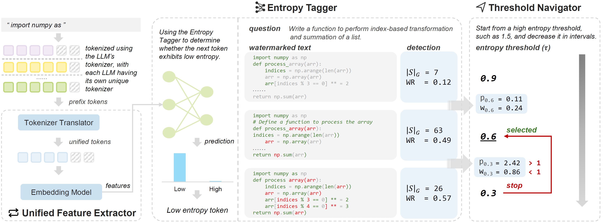

# IE
The official implementation for the paper "Invisible Entropy: A Safe and Efficient Paradigm for Low-entropy Watermarking".



## Set up the environment
Create a conda environment using `watermark.yaml` with the following command:
```bash
conda env create -f watermark.yaml
```

## Train the Entropy Tagger
### Dataset Preprocessing
Navigate to the `ie` folder:
```bash
cd ie
```
Modify `dataset.yaml` to specify the path for saving the preprocessed dataset.
```yaml
model_name_or_path: 
embedding_model_path: 
dataset_name: mbpp
split: validation
```
Run the following command to preprocess and save the dataset:
```bash
python -m utils.dataset
```
### Train Entropy Tagger
Modify `tagger.yaml` to set the hyperparameters used in training.
```yaml
dataset_name: "mbpp"

train_dataset_path: "tagger_dataset_mbpp_entropy0.3_train.pkl"
evaluate_dataset_path: "tagger_dataset_mbpp_entropy0.3_validation.pkl"
test_dataset_path: "tagger_dataset_mbpp_entropy0.3_test.pkl"
other_test_dataset_path: "tagger_dataset_humaneval_entropy0.3_test.pkl"

epochs: 100
batch_size: 32
hidden_size: 768
entropy_threshold: 1.5

lr: 1e-4
weight_decay: 2e-5
early_stopping_threshold: 0.01
```
Run the following command to train entropy tagger and save the model:
```bash
python -m entropy_tagger
```
## Generate Codes with IE
Run the following command to generate codes using IE:
```bash
METHOD='ie' # selected in ie, sweet, wllm
MODEL_PATH='PATH TO LLM(StarCoder)'
GAMMA=0.25
DELTA=1.0
EMBEDDING_MODEL_PATH='PATH TO EMBEDDING MODEL(SimCSE)'
CLASSIFIER_CKPT_PATH='PATH TO ENTROPY TAGGER'

task="humaneval"
max_len=512
batch_size=20
top_p=0.95
n_sample=40

OUTPUT_DIRECTORY='PATH TO SAVE GENERATION'

accelerate launch main.py \
    --model $MODEL_PATH \
    --task $task \
    --temperature 0.2 \
    --precision bf16 \
    --batch_size $batch_size \
    --allow_code_execution \
    --do_sample \
    --top_p $top_p \
    --n_samples $n_sample \
    --max_length_generation $max_len \
    --save_generations_path ${OUTPUT_DIRECTORY}/${MODEL_NAME}_${task}_ie_gamma${GAMMA}_delta${DELTA}_entropy${ENTROPY_THRESHOLD}.json \
    --save_generations \
    --outputs_dir $OUTPUT_DIRECTORY \
    --$METHOD \
    --gamma $GAMMA \
    --delta $DELTA \
    --entropy_threshold $ENTROPY_THRESHOLD \
    --embedding_model_path $EMBEDDING_MODEL_PATH \
    --classifier_ckpt_path $CLASSIFIER_CKPT_PATH \
    --generation_only
```
## Detect watermark using IE
### Machine Detection
Run the following command to detect watermark using IE:

```bash
METHOD='ie' # selected in ie, sweet, wllm
MODEL_PATH='PATH TO LLM(Starcoder) ps: actually not loaded in IE, just need for other methods'
GAMMA=0.25
DELTA=1.0
EMBEDDING_MODEL_PATH='PATH TO EMBEDDING MODEL(SimCSE)'
CLASSIFIER_CKPT_PATH='PATH TO ENTROPY TAGGER'

task="humaneval"
max_len=512
batch_size=20
top_p=0.95
n_sample=40

OUTPUT_DIRECTORY='PATH TO SAVE DIRECTIONS'

accelerate launch main.py \
                --model $MODEL_PATH \
                --task $task \
                --temperature 0.2 \
                --precision bf16 \
                --batch_size $batch_size \
                --allow_code_execution \
                --do_sample \
                --top_p $top_p \
                --n_samples $n_sample \
                --max_length_generation $max_len \
                --load_generations_path $GENERATION_FILE_PATH \
                --outputs_dir $OUTPUT_DIRECTORY \
                --metric_output_path "${MODEL_NAME}_${task}_ie_gamma${GAMMA}_delta${DELTA}_entropy${ENTROPY_THRESHOLD}_detection_only.json" \
                --$METHOD \
                --gamma $GAMMA \
                --delta $DELTA \
                --embedding_model_path $EMBEDDING_MODEL_PATH \
                --classifier_ckpt_path $CLASSIFIER_CKPT_PATH \
                --entropy_threshold $ENTROPY_THRESHOLD  
```

### Human Detection
Run the following command to detect human generated code using IE:

```bash
METHOD='ie' # selected in ie, sweet, wllm
MODEL_PATH='PATH TO LLM(Starcoder) ps: actually not loaded in IE, just used for other methods.'
GAMMA=0.25
DELTA=1.0
EMBEDDING_MODEL_PATH='PATH TO EMBEDDING MODEL(SimCSE)'
CLASSIFIER_CKPT_PATH='PATH TO ENTROPY TAGGER'

task="humaneval"
max_len=512
batch_size=20
top_p=0.95
n_sample=40

OUTPUT_DIRECTORY_HUMAN='PATH TO SAVE HUMAN_DETECTIONS'

accelerate launch main.py \
        --model $MODEL_PATH \
        --task $task \
        --temperature 0.2 \
        --precision bf16 \
        --batch_size $batch_size \
        --allow_code_execution \
        --do_sample \
        --top_p $top_p \
        --n_samples $n_sample \
        --max_length_generation $max_len \
        --detect_human_code \
        --outputs_dir $OUTPUT_DIRECTORY_HUMAN \
        --$METHOD \
        --gamma $GAMMA \
        --delta $DELTA \
        --entropy_threshold $ENTROPY_THRESHOLD \
        --metric_output_path "${MODEL_NAME}_${task}_ie_gamma${GAMMA}_delta${DELTA}_entropy${ENTROPY_THRESHOLD}_${SUFFIX}_human_evaluation.json" \
        --embedding_model_path $EMBEDDING_MODEL_PATH \
        --classifier_ckpt_path $CLASSIFIER_CKPT_PATH \
        --entropy_threshold $ENTROPY_THRESHOLD 

```

## Threshold Navigator
After code generation and watermark detection, you can use Threshold Navigator to adjust the entropy threshold for each instance. This process helps achieve an optimal entropy threshold, as outlined in the paer.

Run the following command to use Threshold Navigator:
```bash
python -m navigator
```